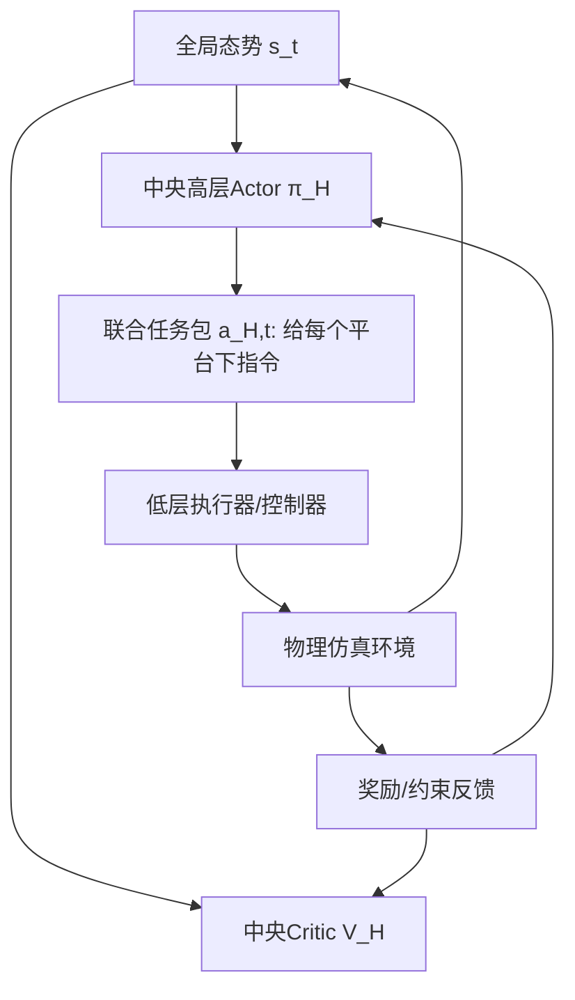

# 方案A：中央协同决策智能体（分层设计）- 设计说明与实现/训练建议

本文面向 **DJ防御场景BL任务规划** 的需求，给出比当前 demo（更像方案B：去中心化执行 + 集中critic）更贴合“指挥中枢”的 **方案A**：  
**中央高层Actor（分钟级调度） + 低层执行器（秒级控制/轨迹跟随/避碰）**。

---

## 1. 方案A的核心思想（为什么要分层）

### 1.1 两类决策本质不同
- **任务规划/调度（分钟级）**：派谁去哪里、负责哪片区域、什么时候切换任务、传感器用什么模式、速度档位怎么选。  
  这是全局耦合、强约束、多目标优化问题（覆盖重访、识别周期、续航、安全距离、兵力最少等）。
- **运动控制/执行（秒级）**：如何在动力学约束下到达目标区域、如何沿航路扫描、如何避碰/保持安全距离。  
  这是连续控制与约束执行问题。

把这两类决策塞进同一个“端到端每秒输出推力”的RL动作空间，会导致：
- 动作维度爆炸、学习难
- 长时程约束难以满足
- 结果难解释/难落地

因此采用分层：**高层学“指挥”，低层负责“开车/开船/飞行控制”。**

---

## 2. 方案A的结构定义

### 2.1 模块划分
- **中央高层Actor（Central High-level Actor）**  
  输入：全局态势（所有平台状态 + 覆盖状态 + 目标状态 + 约束统计）  
  输出：对所有平台的联合“任务包”指令（分钟级更新）
- **中央Critic（Central Critic）**  
  输入：同样的全局态势  
  输出：高层动作的价值评估（用于PPO/Actor-Critic训练）
- **低层执行器（Per-platform Executor）**  
  输入：高层任务包 + 平台局部状态（位置/速度/航向等）  
  输出：可执行控制（推力/航向变化/速度档位/航路点跟踪）

### 2.2 数据流（示意）

---

## 3. 高层动作空间（推荐从A1开始）

### 3.1 A1：区域分配 + 模式选择（最推荐的第一版）
每个高层决策步（例如每 1 分钟）对每个平台输出：
- **任务类型**：巡逻/识别/返航/待命/转移（与文档5.3一致）
- **目标参数**：区域ID或目标ID
- **速度档位**：平台类型对应档位表
- **传感器模式**：搜索/识别

高层动作可以建模为离散-参数化混合动作，例如：
- `task_id ∈ {0..4}`
- `target_id ∈ {0..N_regions or N_targets}`
- `speed_level ∈ {0..3}`
- `sensor_mode ∈ {0,1}`

实现上有两条路线：
- **(a) 多离散头（multi-discrete）**：每个平台输出4个离散分布
- **(b) 单离散“动作码本”**：把 (task, target, speed, sensor) 编码成一个大离散动作（更简单但动作数大）

### 3.2 A2：航路点/参考轨迹输出（下一阶段）
中央Actor直接输出每个平台下一段航路点或轨迹参数（更贴近航路规划），但会更难训练，因为要处理动力学可行性与安全约束。

---

## 4. 低层执行器（可先规则化，保证可落地）

低层执行器的目标是：把高层“区域/目标”指令转换为可执行的物理控制。

### 4.1 推荐的低层实现（从简单到复杂）
- **规则扫描器（coverage executor）**：在责任区域内走“蛇形/螺旋/沿边界”覆盖路径  
  适合快速验证“高层分配是否合理”。
- **航路点跟踪器（pure pursuit / PID）**：高层给航路点序列，低层跟踪  
  可逐步加入避碰/安全距离。
- **低层RL（可选）**：当规则控制不足时，再考虑用低层RL学习避碰与动力学控制。

### 4.2 为什么低层先规则化更好
这样高层训练时不会被“飞不动/开不稳”的问题干扰，学习会更稳、更快，也更贴近工程系统（指挥系统 + 自动驾驶系统）。

---

## 5. 状态空间（高层观测）怎么设计

高层观测建议按文档 5.2 的三段拼接：

1) **平台状态（每个平台）**：位置/速度/航向/剩余续航/任务状态/责任区/传感器状态/平台类型特征  
2) **覆盖状态（每个区域/网格）**：上次覆盖时间差、是否满足重访、优先级等  
3) **全局状态**：任务进度、历史覆盖率统计、违反约束计数、出动率等

### 5.1 关于异构平台
即便使用共享策略，也必须把 **平台类型/能力参数**编码进观测（one-hot + max_speed/max_range/续航等），否则策略无法学会差异化指挥。

---

## 6. 奖励与约束（高层奖励）

高层奖励建议强调“是否满足任务要求”，而不是只奖励瞬时局部覆盖：
- 覆盖率/重访是否满足（核心）
- 识别周期是否满足（核心）
- 效率（单位资源覆盖面积、无效移动惩罚）
- 资源（出动数量、能耗、返航/补给）
- 约束违反惩罚（安全距离、超时重访、超时识别）

实现上可以用“多项加权”和“逐步加权（curriculum）”：
- 先只优化覆盖（让系统跑起来）
- 再加识别周期
- 再加资源与效率
- 最后加严格约束惩罚

---

## 7. 训练方式（中央Actor的PPO / Centralized PPO）

### 7.1 训练目标
训练一个中央策略 \(π_H(a^H_t | s_t)\)，输出联合高层任务包，使长期回报最大。

### 7.2 算法建议
第一版可用：
- **Centralized PPO（中央Actor + 中央Critic）**  
  训练/执行都集中化，最符合“指挥中枢”。

如果希望未来支持“分布式执行/通信受限”，可过渡为：
- **CTDE / MAPPO**：训练时集中critic，执行时每个执行单元可独立（或按类型独立）

### 7.3 时间尺度处理（关键）
环境内部仍以秒级推进物理仿真，但高层策略每隔 \(K\) 步才更新一次（例如每 60 秒更新一次）。

训练实现上常见两种：
- **(a) 高层一步 = K个物理步的宏动作（Macro-action）**  
  Actor 每次输出一次任务包，环境执行 K 步后返回一个“高层 step”的累积奖励与新状态。
- **(b) 每秒都step，但高层动作保持不变直到下次决策**  
  训练数据按高层决策点采样（推荐(a)更清晰）。

---

## 8. 如何从当前 `coverage_mappo_vmas` demo 迁移到方案A

当前 demo 更像方案B：每个agent各自出动作（共享actor） + 集中critic，偏“自治协同覆盖”。

迁移到方案A的最小改造路线：

1) **把动作从“连续推力”升格为“区域/任务分配”**  
   - 环境内部加入“责任区域”字段
   - 低层执行器接管具体运动（蛇形覆盖/轨迹跟踪）

2) **将策略改为中央Actor**  
   - 中央Actor一次性输出所有平台的任务包（联合动作）
   - critic 输入同一全局态势

3) **训练按高层步长采样**  
   - 每个高层 step 返回累积覆盖奖励/约束惩罚
   - 日志输出更像“规划质量”（满足率、违反次数、覆盖效率）

---

## 9. 建议的“最小可跑版本（MVP）”

为了最快得到可用 demo，建议按以下MVP落地：

- 任务：只做覆盖重访（先不做识别）
- 高层动作：每个平台选择一个子区域ID（区域划分固定，如 4 宫格/8 宫格）
- 低层：规则蛇形扫描 + 简单避碰
- 奖励：重访满足率 + 最大未覆盖时间惩罚 + 轻量能耗惩罚
- 评估：统计“10分钟重访满足率”“最大gap”“出动平台数”“总航程”

这个版本能直接验证：中央调度是否能把异构平台合理分配到不同区域、并长期维持覆盖要求。

---

## 10. 与真实DJ任务的对齐（落地建议）

- 方案A非常适合作为**“离线规划器/滚动规划器”**：  
  每 10 分钟滚动生成未来一段时间的区域划分 + 任务调度 + 航线框架，然后下发给平台自动驾驶执行。
- 强通信约束/失联情况下，可保留低层自治（规则/本地策略），高层只需周期性同步计划。

---

## 11. 下一步建议

如果要继续推进到更贴合BL文档的版本，建议下一步实现：
- 高层：区域分配（A1）+ 速度档位 + 传感器模式
- 环境：网格覆盖 + 重访约束 + 目标识别周期（第二阶段）
- 评估指标：满足率（覆盖/识别）、资源占用、约束违反次数

